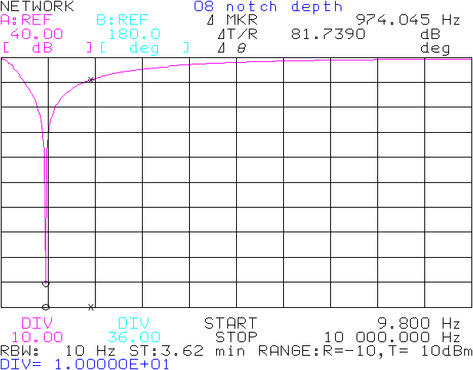

Some utilities for working with HP 4195A vector / spectrum / network analyzer.

Any code found here is licensed under GPLv3.

The most useful is probably `dumpscreen.py` , to retrieve screenshots remotely over GPIB. It uses pyvisa and any of a variety of supported backends.

It can run in one-shot mode saving one screenshot, optionally adding a title to the plot. It can also run in a loop, prompting a new title/filename for each screenshot, then automatically converting to PNG :

It also saves the original HPGL data, in case you need to re-process with less horrendous colors.

